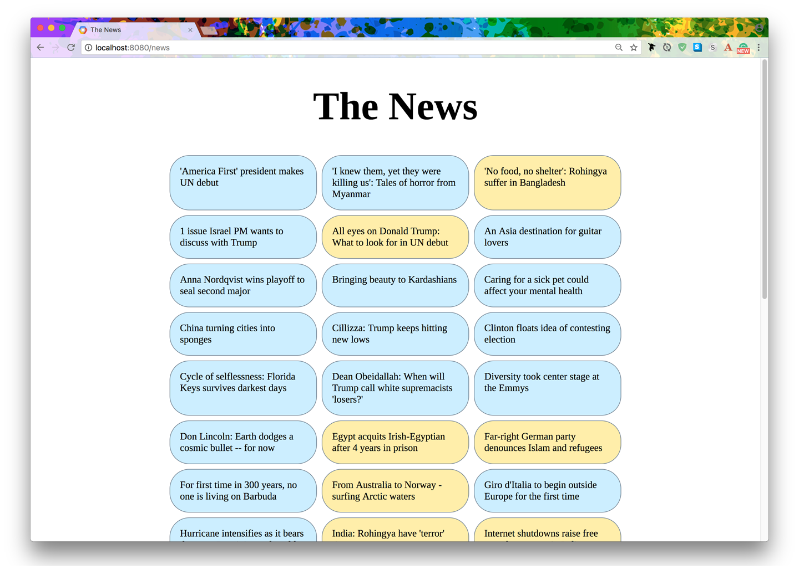

 *Figure 4-1. * *The* * * *final* * product of our news scraper: headlines from CNN are shown in one* *color, and Al Jazeera in another* Web scraping has become quite difficult nowadays. For example, if you try `requests.get('http://edition.cnn.com')` , you’re going to find that the response contains very little usable data! It has become increasingly necessary to be able to execute JavaScript locally in order to obtain data, because many sites use JavaScript to load their actual content. The process of executing such JavaScript to produce the final, complete HTML output is called  *rendering* . To accomplish rendering, we use a neat project called  Splash , which describes itself as a “JavaScript rendering service.” It can run in a  Docker  container and provides an API for rendering other sites. Internally, it uses a (JavaScript-capable) WebKit engine to fully load and render a website. This is what we’ll use to obtain website data. Our `aiohttp`  server, shown in  Example 4-14 , will call this Splash API to obtain the page data. **94 ** **| ** **Chapter 4: 20 Asyncio Libraries You Aren’t Using (But…Oh, Never Mind)**