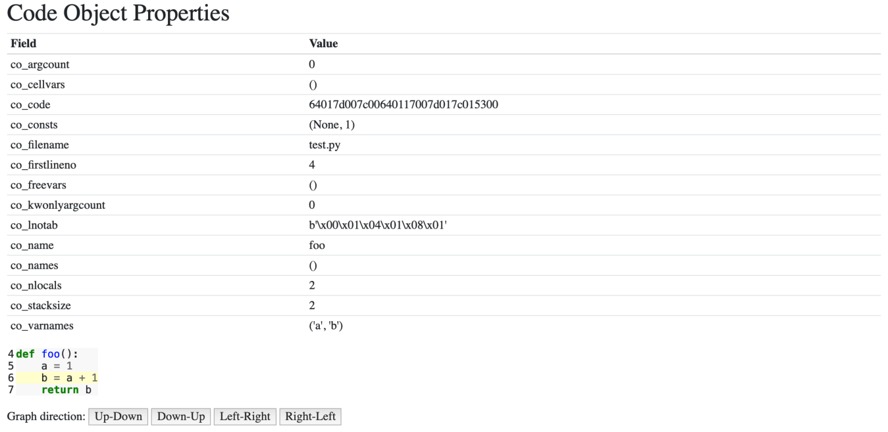

Abstract Syntax Trees 

 The bottom left graph is the function you declared in REPL, represented as an Abstract Syntax Tree. Each node in the tree is an AST type. They are found in the  ast  module, and all inherit from  _ast.AST . Some of the nodes have properties that link them to child nodes, unlike the CST, which has a generic child node property. For example, if you click on the Assign node in the center, this links to the line  b = a + 1 : 106