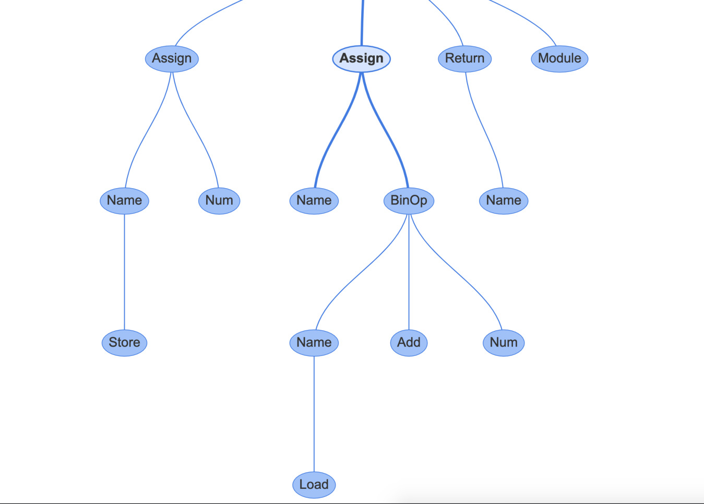

Abstract Syntax Trees 

 The  assign  node has two properties: 1.  targets  is a list of names to assign. It is a list because you can assign to multiple variables with a single expression using unpacking 2.  value  is the value to assign, which in this case is a  BinOp  statement, a + 1 . If you click on the  BinOp  statement, it shows the properties of relevance: •  left :  the node to the left of the operator •  op :  the operator, in this case, an  Add  node ( + ) for addition •  right :  the node to the right of the operator 107