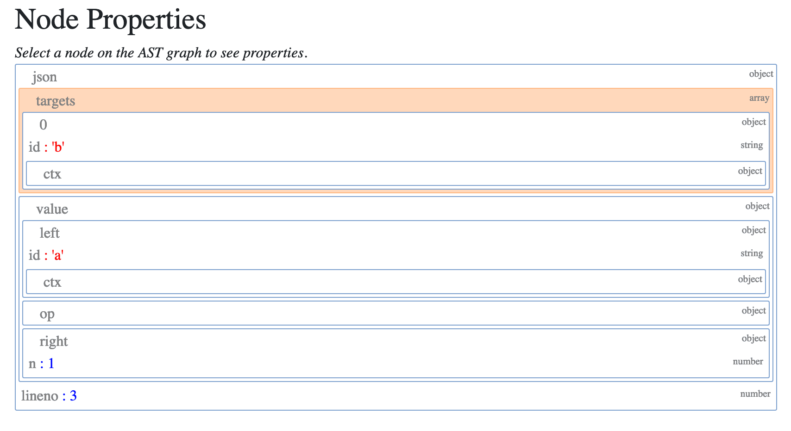

Abstract Syntax Trees 

 
##AST Compilation 

 Compiling an AST in C is not a straightforward task. The  Python ast.c module has over 5000 lines of code. There are a few entry points, forming part of the AST’s public API. The AST API takes a node tree (CST), a filename, the compiler flags, and a memory storage area. The result type is  mod_ty  representing a Python module, defined in  Include Python-ast.h . mod_ty  is a container structure for one of the five module types in Python: 1.  Module 2.  Interactive 3.  Expression 4.  FunctionType 5.  Suite The module types are all listed in  Parser Python.asdl . You will see the module types, statement types, expression types, operators, and comprehensions all defined in this file. The names of the types in  Parser Python.asdl  relate to the classes generated by the AST and the same 108