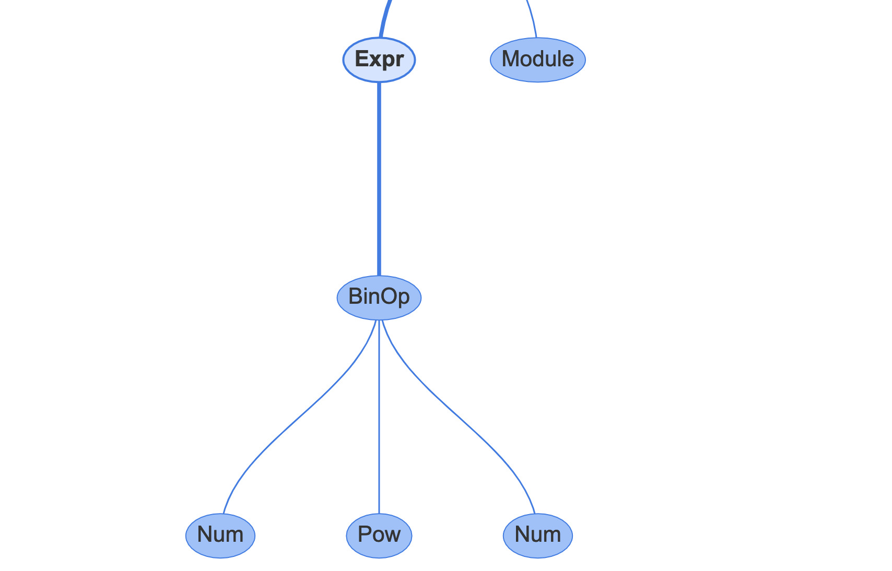
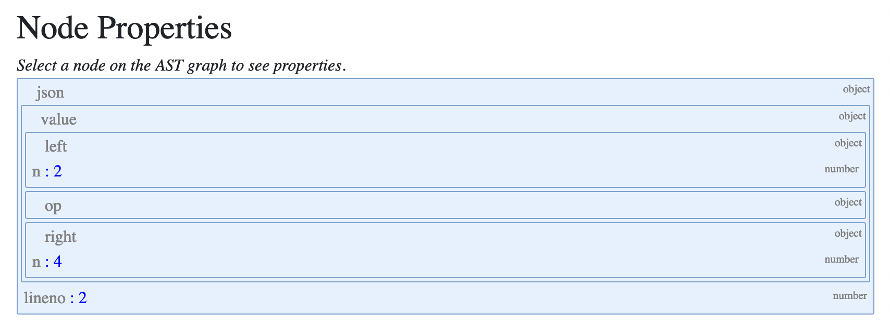

Abstract Syntax Trees 

 In the UI, you can also see the corresponding properties: 

 In summary, each statement type and expression has a corresponding ast_for_*()  function to create it. The arguments are defined in  Parser Python.asdl  and exposed via the  ast  module in the standard library. If an expression or statement has children, then it will call the corresponding  ast_for_*  child function in a depth-first traversal. 112