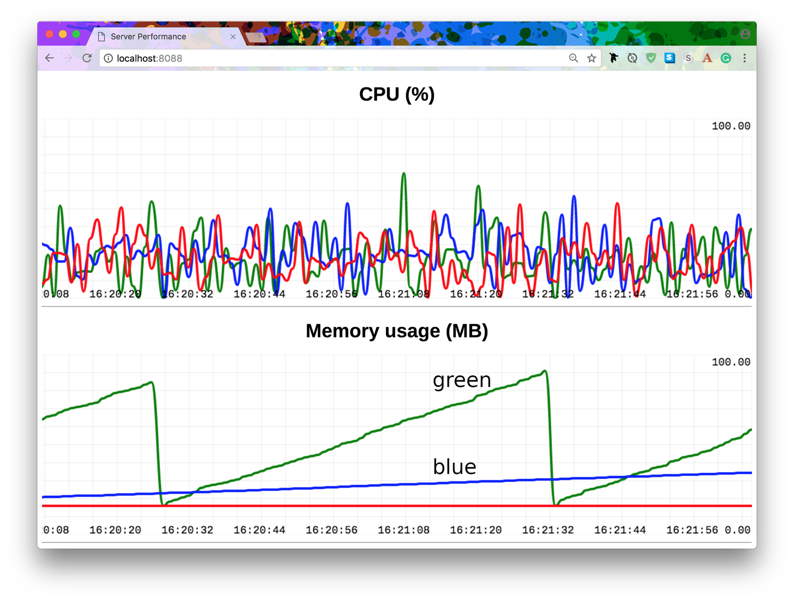

We also obtain the timestamp and parse it to get the correct format required by the chart. Now we can run the code. To get the whole show moving, a bunch of command-line instructions are required, the first of which is to start up the data collector process: `$ ` `metric-server.py` `======== Running on http://127.0.0.1:8088 ========` `(Press CTRL+C to quit)` The next step is to start up all the microservice instances. These will send their CPU and memory usage metrics to the collector. Each will be identified by a different color, which is specified on the command line. Note how two of the microservices are told to leak some memory: `$ ` `backend-app.py --color red &` `$ ` `backend-app.py --color blue --leak 10000 &` `$ ` `backend-app.py --color green --leak 100000 &` Figure 4-2  shows our final product in a browser. You’ll have to take my word for it that the graphs really do animate. You’ll notice in the preceding command lines that I added some memory leakage to blue, and a lot to green. I even had to restart the green service a few times to prevent it from climbing over 100 MB. 

 *Figure 4-2. We’d better get an SRE on green ASAP!* **ØMQ (ZeroMQ) ** **| ** **109**