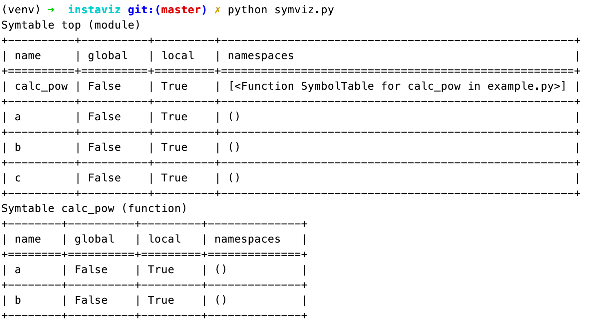

Symbol Tables Run  symviz.py  at the command-line to see the symbol tables for the example code: 

 
##Symbol Table Implementation 

 The implementation of symbol tables is in  Python symtable.c  and the primary interface is the  PySymtable_BuildObject()  function. Similar to AST compilation covered in the last chapter, the PySymtable_BuildObject()  function switches between the  mod_ty  possible types (Module, Expression, Interactive, Suite, FunctionType), and visits each of the statements inside them. The Symbol Table will recursively explore the nodes and branches of the AST (of type  mod_ty ) and add entries to the symtable: Python symtable.c  line 261 struct  symtable * PySymtable_BuildObject(mod_ty mod, PyObject *filename, PyFutureFeatures *future) { struct  symtable *st = symtable_new(); 128