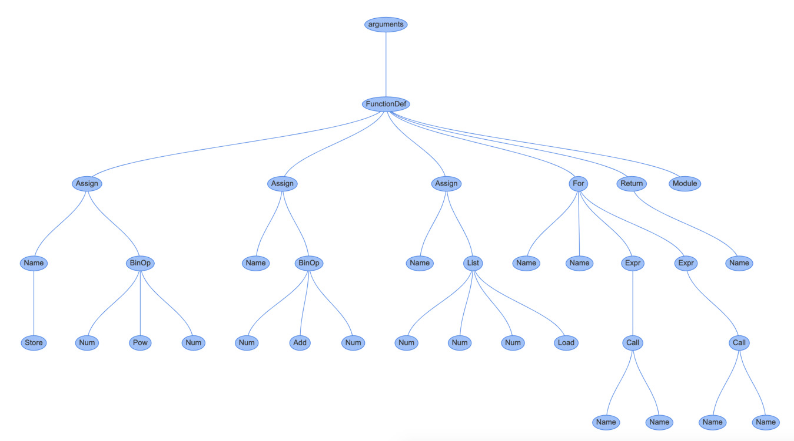

Using Instaviz to Show a Code Object a  =  2 ** 4 b  =  1  +  5 c  =  [ 1 ,  4 ,  6 ] for  i  in  c: print(i) else : print(a) return  c instaviz.show(foo) Will produce a large and complex AST graph: 

 You can see the bytecode instructions in sequence: 145