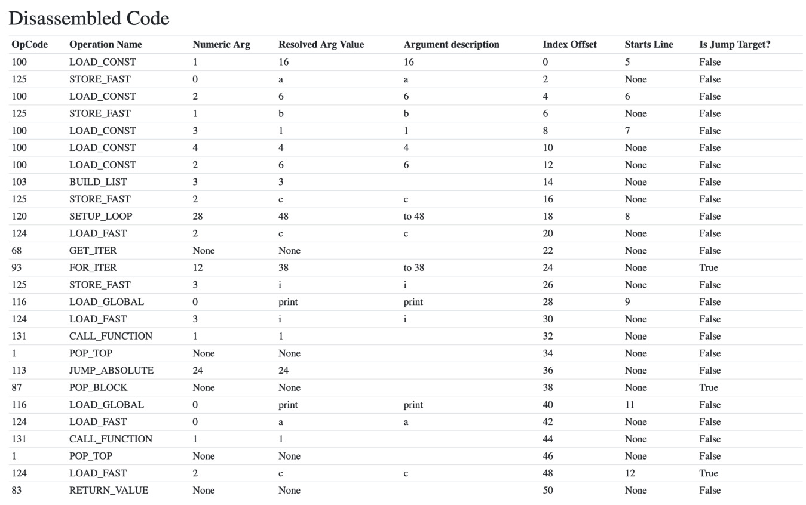
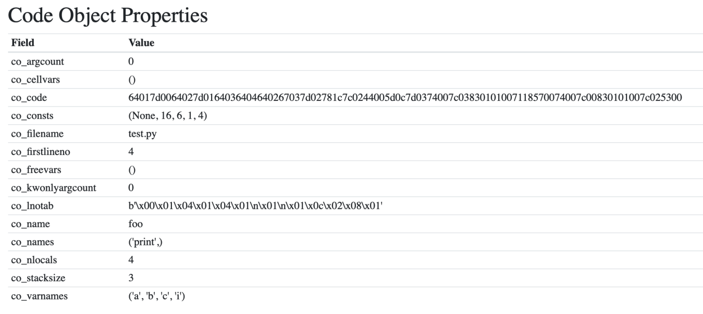

Using Instaviz to Show a Code Object 

 The code object with the variable names, constants, and binary  co_- code : 

 Try it out with some other, more complex code that you have to learn more about CPython’s compiler and code objects. 146