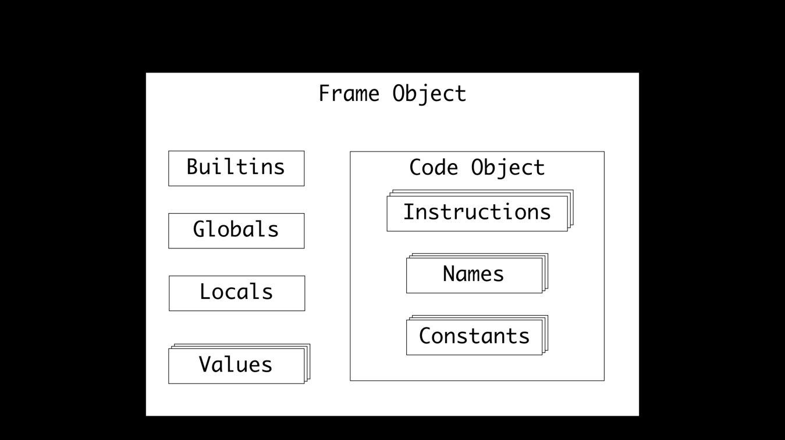

Constructing Frame Objects also available from the C API using  PyFrame_New() . The  _PyFrame_New_- NoTrack()  function will create a new  PyFrameObject  by following these steps: 1. Set the frame  f_back  property to the thread state’s last frame 2. Load the current builtin functions by setting the  f_builtins  property and loading the builtins module using  PyModule_GetDict() 3. Set the  f_code  property to the code object being evaluated 4. Set the  f_valuestack  property to the 5. Set the  f_stacktop  pointer to  f_valuestack 6. Set the global property,  f_globals , to the  globals  argument 7. Set the locals property,  f_locals , to a new dictionary 8. Set the  f_lineno  to the code object’s  co_firstlineno  property so that tracebacks contain line numbers 9. Set all the remaining properties to their default values With the new  PyFrameObject  instance, the arguments to the frame object can be constructed: 

 161