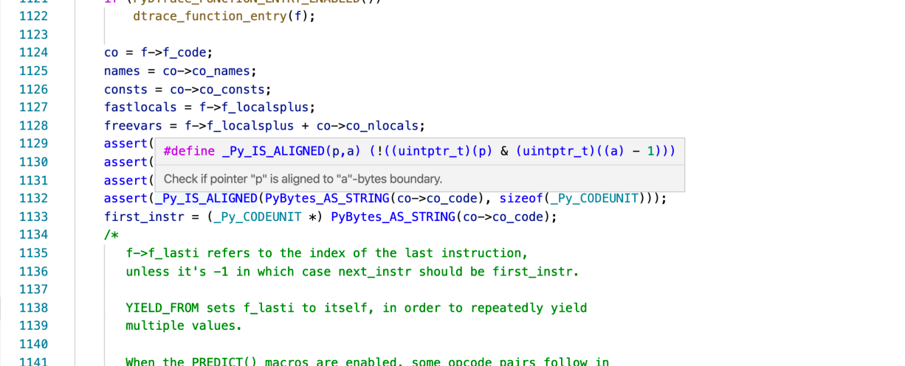

Frame Execution Note Something you might notice when reading  Python ceval.c , is how many times C macros have been used. C Macros are a way of having reusable code without the overhead of making function calls. The compiler converts the macros into C code and then compile the generated code. If you want to see the expanded code, you can run  gcc -E  on Linux and macOS: $ gcc -E Python/ceval.c In  Visual Studio Code , inline macro expansion shows once you have installed the official C/C++ extension: 

 In CLion, select a macro and press   Alt  +  Space  to  peek into it’s definition . 
##Frame Execution Tracing 

 You can step through frame execution in Python 3.7 and beyond by enabling the tracing attribute on the current thread. In the  PyFrameObject type, there is a  f_trace  property, of type  PyObject * . The value is expected to point to a Python function. This code example sets the global tracing function to a function called 167