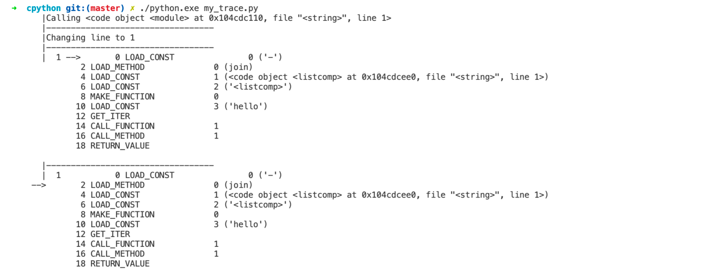

The Value Stack This code snippet prints the code within each stack and points to the next operation before it is executed. When a frame returns a value, the return statement is printed: 

 The full list of possible bytecode instructions is available on the  dis module  documentation. 
#The Value Stack 

 Inside the core evaluation loop, a value stack is created. This stack is a list of pointers to  PyObject  instances. These could be values like variables, references to functions (which are objects in Python), or any other Python object. Bytecode instructions in the evaluation loop will take input from the value stack. 
##Example Bytecode Operation, BINARY_OR 

 The binary operations that you have been exploring in previous chapters compile into a single instruction. If you inserted an  or  statement in Python: 169