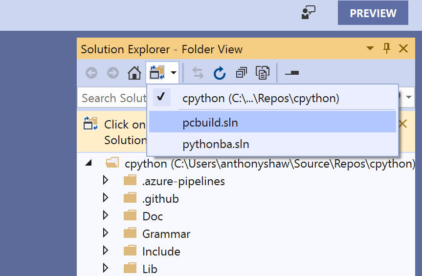

Setting up Visual Studio Once the installer has completed, click the   Launch  button to start Visual Studio. You will be prompted to sign in. If you have a Microsoft account, you can log in, or skip that step. You will now be prompted to Open a Project. You can clone CPython’s Git repository directly from Visual Studio by choosing the Clone or check out code  option. For the Repository Location, enter  https://github.com/python/cpython , chose your Local path, and select   Clone  . Visual Studio will then download a copy of CPython from GitHub using the version of Git bundled with Visual Studio. This step also saves you the hassle of having to install Git on Windows. The download may take 10 minutes. Once the project has downloaded, you need to point Visual Studio to the PCBuild pcbuild.sln  Solution file, by clicking on Solutions and Projects pcbuild.sln  : 

 Now that you have Visual Studio configured and the source code 27