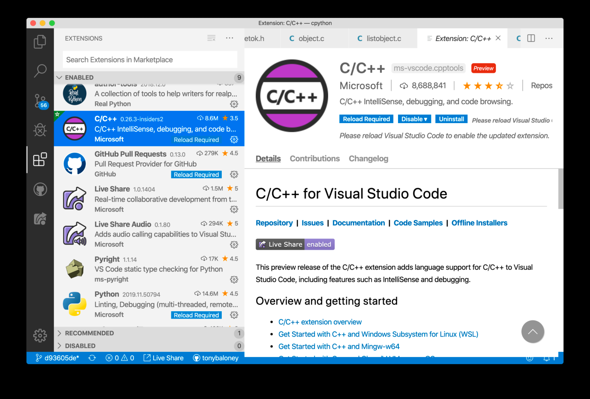

Setting up Visual Studio Code 

 Inside the extensions panel, you can search for extensions by name or by their unique identifier, e.g., ‘ ms-vscode.cpptools .’ In some cases, there are many plugins with similar names, so to be sure you’re installing the right one, use the unique identifier. 
##Recommended Extensions for This Book 

 •  C/C++ ( ms-vscode.cpptools )  Provides support for C/C++, including IntelliSense, debugging and code highlighting. •  Python ( ms-python.python )  Provides rich Python support for editing, debugging, and reading Python code. •  Restructured Text ( lextudio.restructuredtext ) Provides rich support for reStructuredText, the format used in the CPython documentation. •  Task Explorer ( spmeesseman.vscode-taskexplorer )  Adds a “Task Explorer” panel inside the Explorer tab, making it easier to launch make  tasks. 29