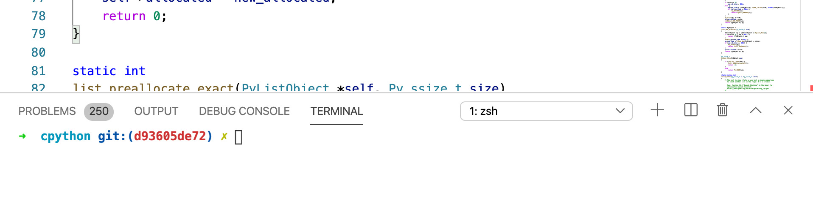
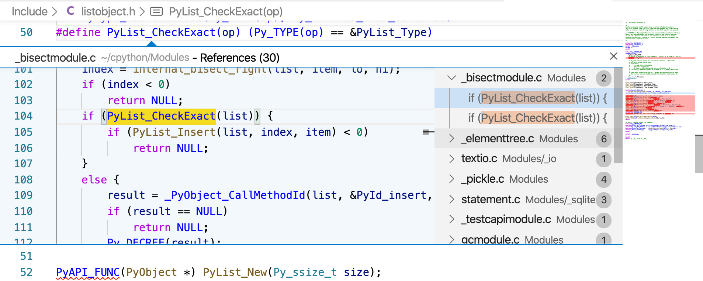

Setting up Visual Studio Code Once you have installed these extensions, you will need to reload the editor. Because many of the tasks in this book require a command-line, you can add an integrated Terminal into VS Code by selecting   Terminal New Terminal  and a terminal will appear below the code editor: 

 
##Using the Advanced Code Navigation 

 
##(IntelliSense) 

 With the plugins installed, you can perform some advanced code navigation. For example, if you right-click on a function call in a C file and select Go to References  it will find other references in the codebase to that function: 

 30