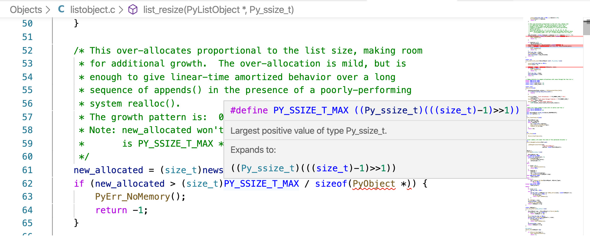

Setting up Visual Studio Code Go to References  is very useful for discovering the proper calling form for a function. By clicking or hovering over a C Macro, the editor will expand that Macro to the compiled code: 

 To jump to the definition of a function, hover over any call to it and press   cmd  +  click  on macOS and   ctrl  +  click  on Linux and Windows. 
##Con�guring the Task and Launch Files 

 VS Code creates a folder,  .vscode  in the Workspace Directory. Inside this folder, you can create: •  tasks.json  for shortcuts to commands that execute your project •  launch.json  to configure the debugger (see the chapter on Debugging) • other plugin-specific files Create a  tasks.json  file inside the  .vscode  directory. If it doesn’t exist, create it now. This  tasks.json  will get you started: cpython-book-samples 11 tasks.json 31