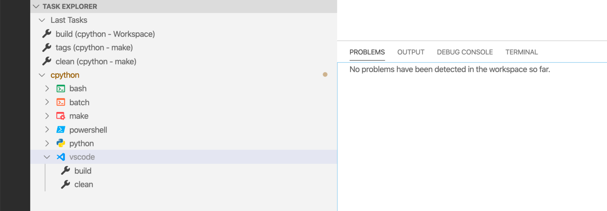

Setting up Visual Studio Code { "version" :  "2.0.0" , "tasks" :  [ { "label" :  "build" , "type" :  "shell" , "group" : { "kind" :  "build" , "isDefault" :  true }, "windows" :{ "command" :  "PCBuild \b uild.bat" , "args" :  [ "-p x64 -c Debug" ] }, "linux" :{ "command" :  "make -j2 -s" }, "osx" :{ "command" :  "make -j2 -s" } } ] } With the  Task Explorer  plugin, you will see a list of your configured tasks inside the  vscode  group: 

 In the next chapter, you will learn more about the build process for 32