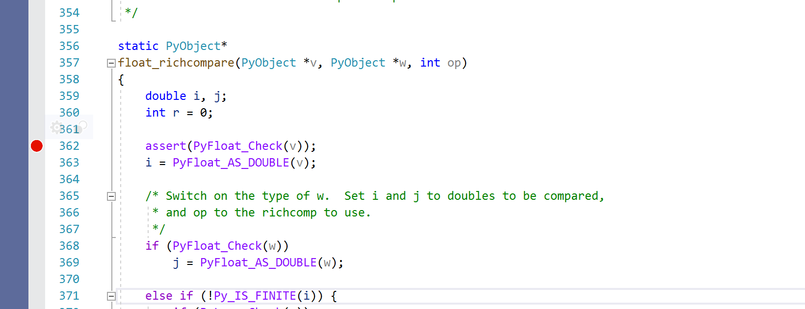

Using Visual Studio Debugger Command Purpose py-down Go up one Python frame py-list Print the Python source code for the current frame 
#Using Visual Studio Debugger 

 Microsoft Visual Studio comes bundled with a visual debugger. This debugger is powerful, supports a frame stack visualizer, a watch list, and the ability to evaluate expressions. Open Visual Studio and the  PCBuild pcbuild.sln  solution file. 
##Adding Breakpoints 

 To add a new breakpoint, navigate to the file you want in the solution window, then click in the gutter to the left of the line number. This adds a red circle to indicate a breakpoint has been set on this line: 

 When you hover over the red circle, a cog appears. Click on this cog to configure conditional breakpoints. Add one or more conditional expressions which must evaluate before this breakpoint hits: 340