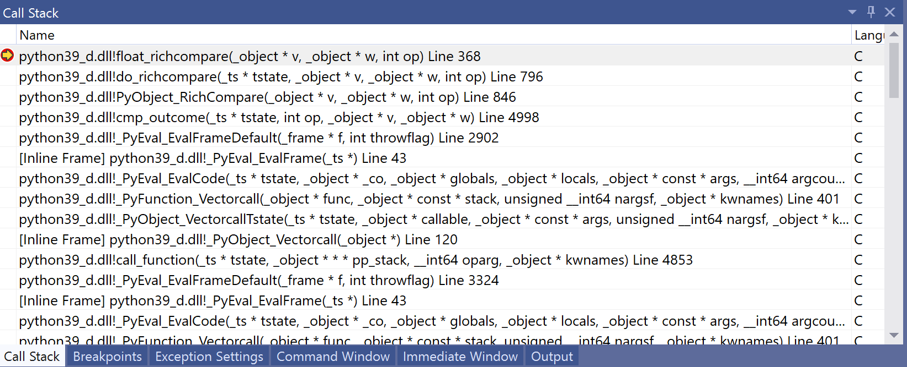
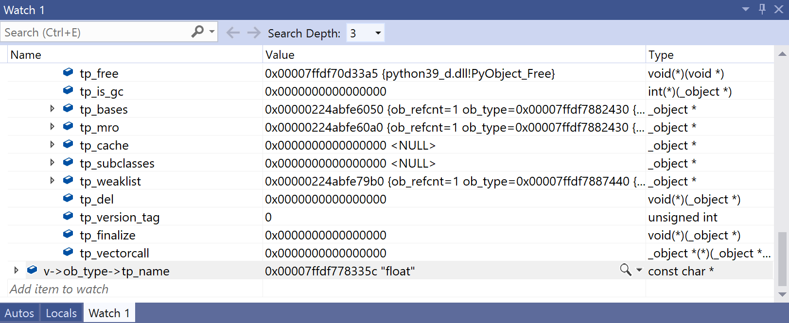

Using CLion Debugger 

 In the code editor, you can highlight any variable or expression to see its value. You can also right-click and choose “Add Watch.” This adds the variable to a list called the Watchlist, where you can quickly see the values of variables you need to help you debug: 

 
#Using CLion Debugger 

 The CLion IDE comes with a powerful visual debugger bundled. It works with lldb on macOS, and gdb on macOS, Windows, and Linux. To configure the debugger, go to Preferences and select   Build, Execution, Deploymen Toolchains  : 342