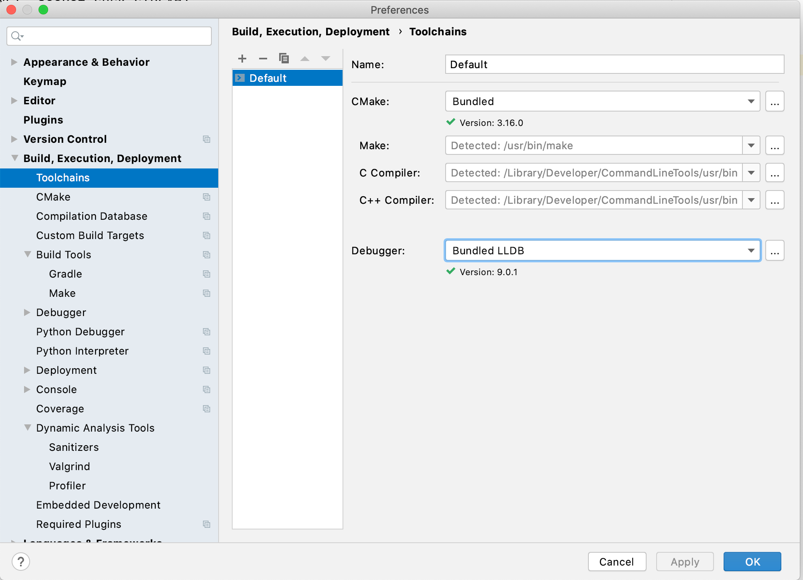

Using CLion Debugger 

 There is a selection box for the target debugger. Select one of the options: • For macOS use the “Bundled LLDB” • For Windows or Linux, use the “Bundled GDB” Important Both the LLDB and GDB support benefit from the  cpython-lldb and  python-gdb  extensions, respectively. Read the LLDB and GDB sections in this chapter for information on how to install and enable these extensions. 
##Con�guring the Custom Build Targets 

 With your toolchain configured, you can now create Custom Build Targets to enable debugging. 343