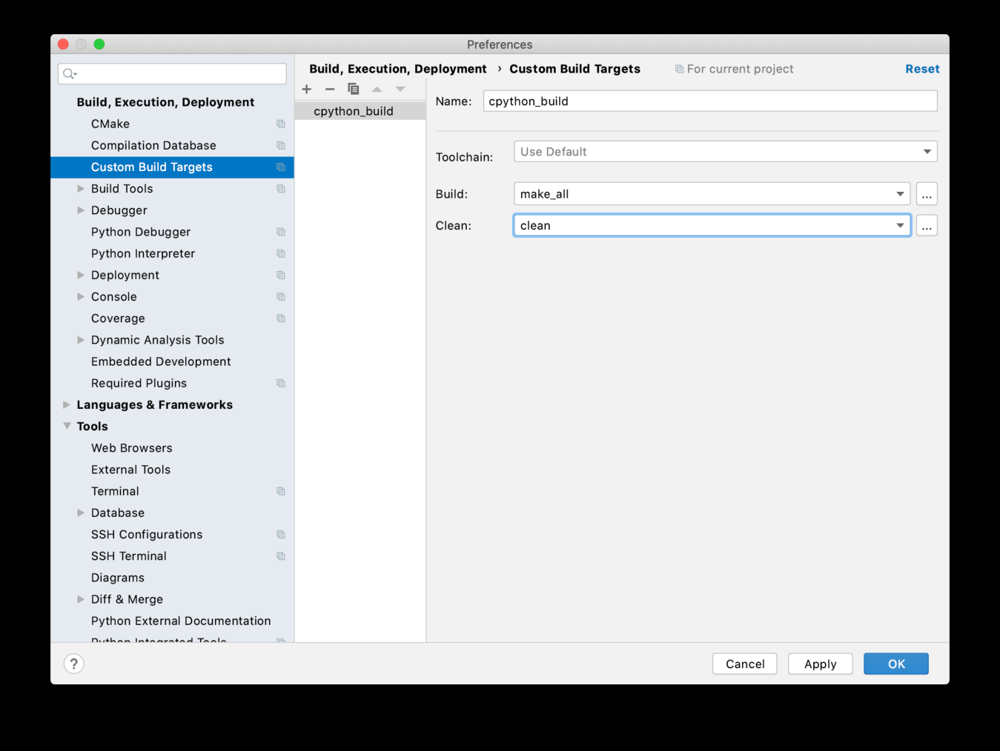

Using CLion Debugger 

 Once this task is completed, you can build, rebuild and clean from the Build  menu. 
##Con�guring the Custom Debug Target 

 To debug the compiled CPython executable from the Run/Debug Configurations, open the configuration panel from   Run Edit Configurations...  . Add a new configuration by selecting   + Custom Build Application  : • Set the  Target  as  cpython_build , the Custom Build Target you just created • Set the  Executable  as  python  for Linux and  python.exe  for macOS • Set the  Working Directory  as  $ProjectFileDir$ 347