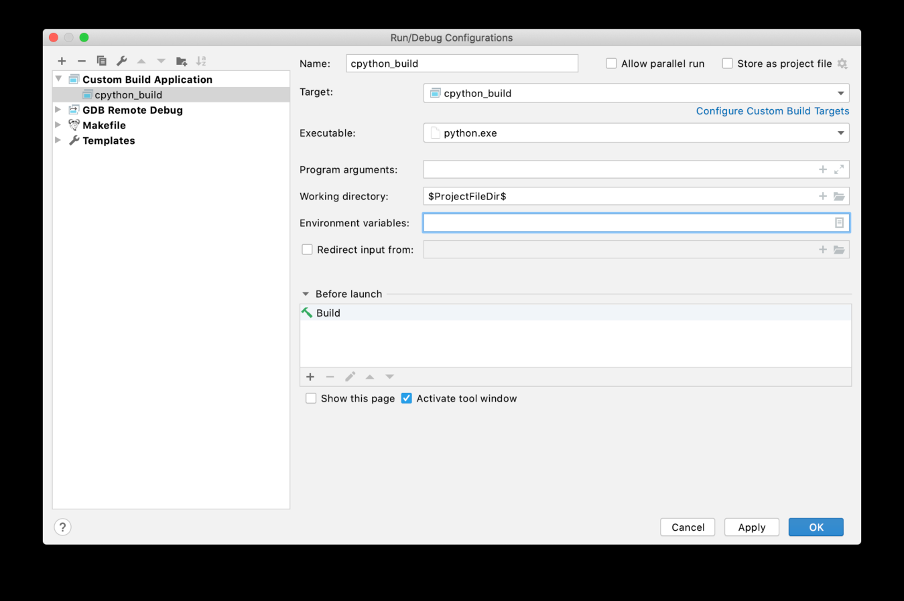

Using CLion Debugger 

 With this Run/Debug Configuration, you can now debug directly from the   Run Debug  menu. Alternatively, you can attach the debugger to a running CPython process. 
##Attaching the Debugger 

 To attach the CLion debugger to a running CPython process, select Run Attach to Process  . A list of running processes will pop-up. Find the  python  process you want to attach to and select   Attach  . The debugging session will begin. 348