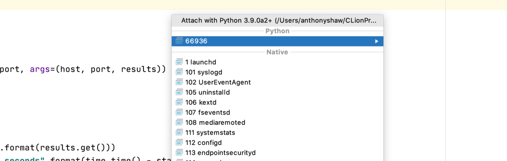
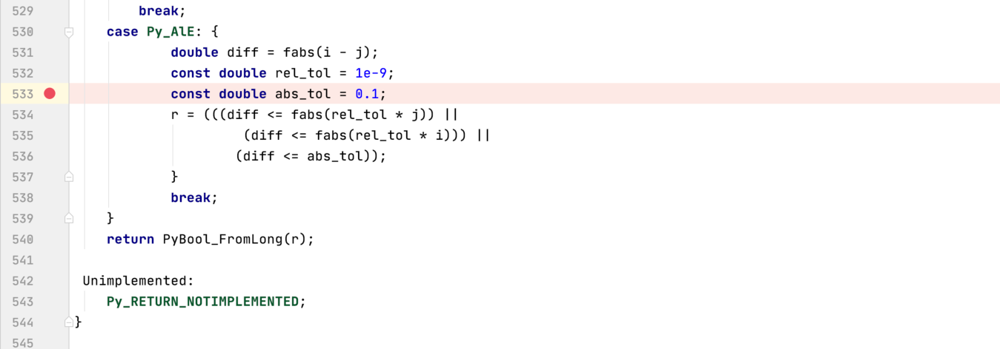

Using CLion Debugger Important If you have the Python plugin installed, it will show the  python process at the top. Don’t select this one! This uses the Python debugger, not the C debugger. 

 Instead, scroll further down into the “Native” list and find the correct  python  process. 
##Creating Breakpoints 

 To create a breakpoint, navigate to the file and line you want, then click in the gutter between the line number and the code. A red circle will appear to indicate the breakpoint is set: 

 Right-click on the breakpoint to attach a condition: 349