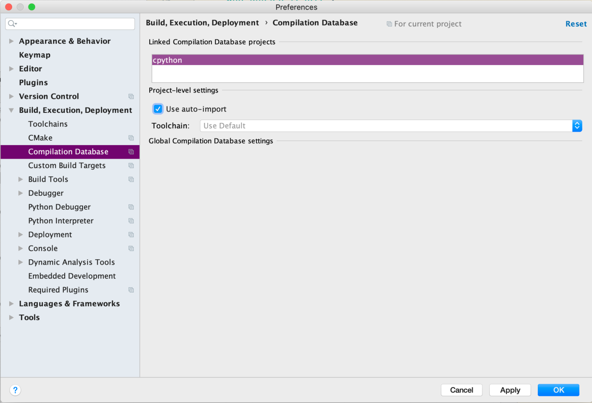

Setting up JetBrains CLion Note For versions of CLion before 2020.1, you need to link the compile commands and the project together. Go to CLion Settings, Build, Execution, Deployment Compilation Database and check the “Use auto-import” box: 

 When you open this project in the future, it will have intelligent code navigation based on the compiled version of CPython. Within the code editor, the shortcut   cmd  +  click  on macOS, and   ctrl  + click  on Windows and Linux will give in-editor navigation features: 35