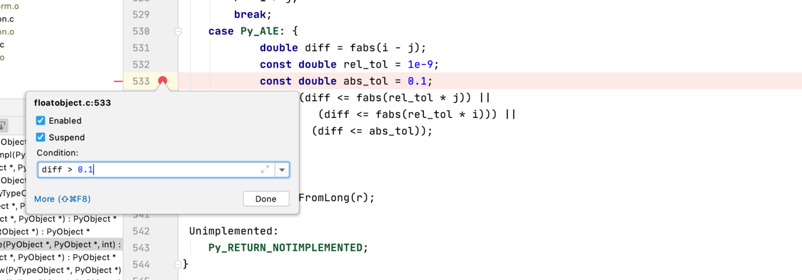
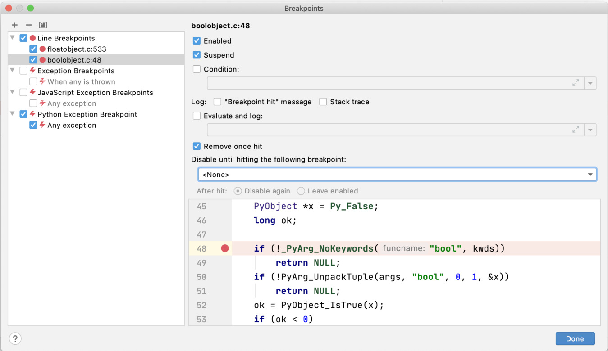

Using CLion Debugger 

 To see and manage all current breakpoints, navigate from the top menu to   Run View Breakpoints  : 

 You can enable and disable breakpoints, as well as disable them once another breakpoint has been hit. 
##Handling Breakpoints 

 Once a breakpoint has been hit, CLion will set up the Debug panel. Inside the Debug panel is a call stack, showing where the breakpoint hit. You can select other frames in the call stack to switch between them. 350