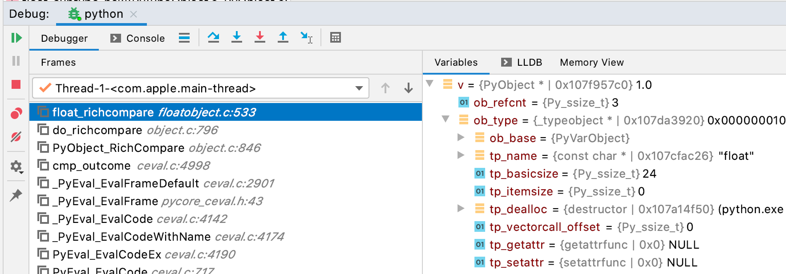
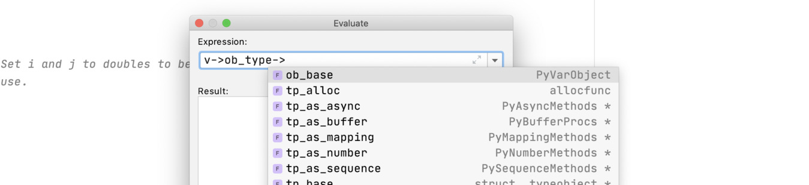
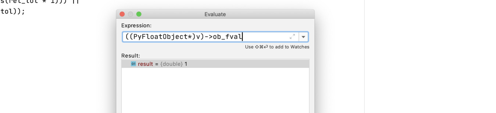

Using CLion Debugger Next to the call stack are the local variables. The properties of pointers and type structures can be expanded, and the value of simple types is shown: 

 Within a break, you can evaluate expressions to get more information about the local variables. The Evaluation Window can be located in Run Debugging Actions Evaluate Expression  , or in a shortcut icon in the Debug Window. Inside the Evaluate window, you can type expressions and CLion will type-ahead with the property names and types: 

 You can also cast expressions, which is useful for casting  PyObject*  into the actual type, for example into a  PyFloatObject* : 

 351