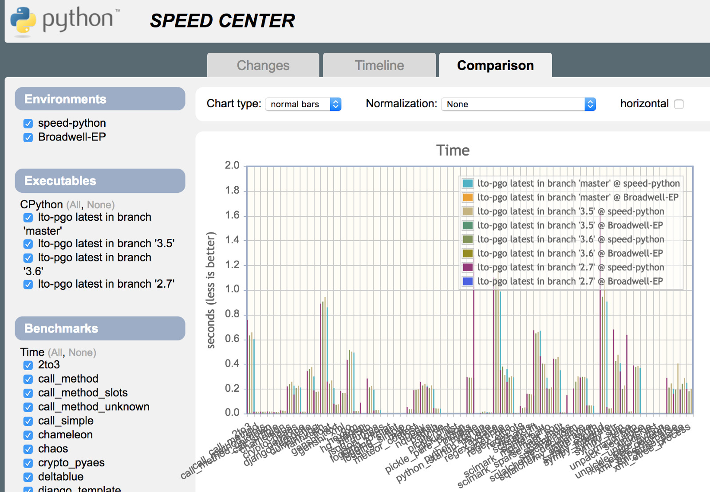

Using the Python Benchmark Suite for Runtime Benchmarks 

 You can compare commits, branches, and tags side by side on the speed center. The benchmarks use both the Profile Guided Optimization and regular builds with a fixed hardware configuration to produce stable comparisons. To install the Python benchmark suite, install it from PyPi using a Python runtime (not the one you are testing) in a virtual environment: (venv) $ pip install performance Next, you need to create a configuration file and an output directory for the test profile. It is recommended to create this directory outside of your Git working directory. This also allows you to checkout multiple versions. In the configuration file, e.g.,  ~/benchmarks/benchmark.cfg , put the following contents: cpython-book-samples 62 benchmark.cfg 357