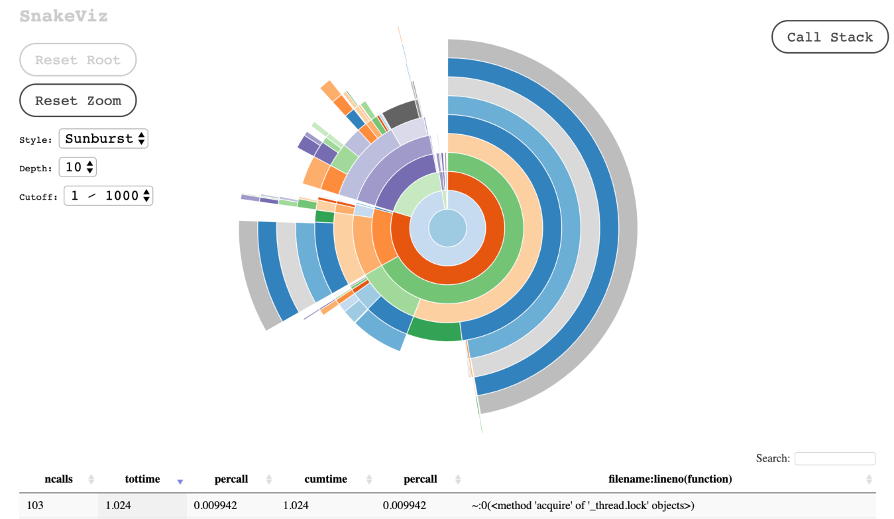
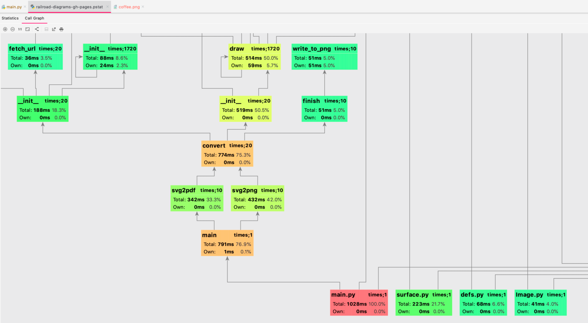

Profiling Python Code with cProfile 

 Visualizing with PyCharm PyCharm has a builtin tool for running cProfile and visualizing the results. To execute this, you need to have a Python target configured. To run the profiler, select your run target, then on the top menu select Run Profile (target)  . This will execute the run target with cProfile and open a visualization window with the tabular data and a call graph: 

 364