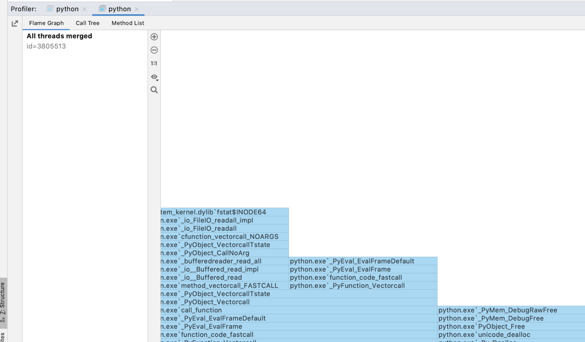

Profiling C Code with Dtrace $ ls Include/pydtrace_probes.h Include/pydtrace_probes.h Important Newer versions of macOS have kernel-level protection that interferes with dtrace called System Integrity Protection. The examples in this chapter use the CPython probes. If you want to include libc or syscall probes to get extra information, you will need to disable SIP. 
##Using Dtrace From CLion 

 The CLion IDE comes bundled with dtrace support. To start tracing, select   Run Attach Profiler to Process..  and select the running Python process. The profiler window will prompt you to start and then stop the tracing session. Once tracing is complete, it provides you with a flame graph showing execution stacks and call times, a Call Tree and a Method List: 

 367