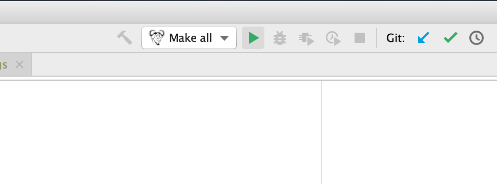

Setting up Vim The  Make all  build configuration will now be available in the top-right of the CLion window: 

 Now that CLion is set up follow the steps for compiling CPython. 
#Setting up Vim 

 Vim is a powerful console-based text editor. Use Vim with your hands resting on the keyboard home keys. The shortcuts and commands are within reach for fast development. Note On most Linux distributions and within the macOS Terminal, vi  is an alias for  vim . I’ll use the  vim  command, but if you have the alias,  vi  will also work. Out of the box, Vim has only basic functionality, little more than a text editor like Notepad. With some configuration and extensions, Vim can become powerful for both Python and C editing. Vim’s extensions are in various locations, like GitHub. To ease the configuration and installation of plugins from GitHub, you can install a plugin manager, like  Vundle . To install Vundle, run this command at the terminal: 37