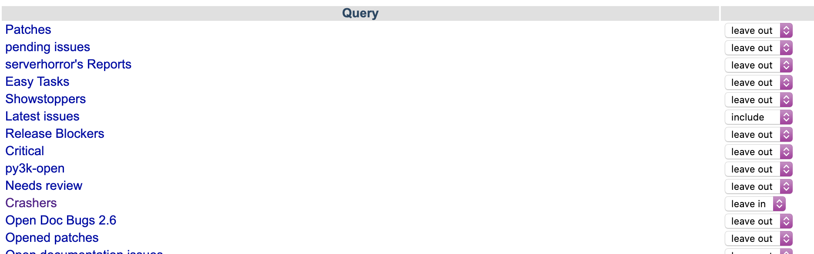

Using This Knowledge to Contribute to the CPython Project This page will give you a list of queries for the bug index that you can bookmark: 

 Figure 0.1: bpo-screenshot Change the value to “leave in” to include these queries in the Your Queries  menu. Some of the queries I find useful are: •  Easy Documentation Issues  - showing some documentation improvements that haven’t been made •  Easy Tasks  - showing some tasks that have been identified as good for beginners •  Recently Created  - recently created issues •  Reports without replies  - bug reports that never got a reply •  Unread  - bug reports that never got read •  50 latest issues  - the 50 most recently updated issues With these views, you can follow the  Triaging an Issue  guide for the latest process on commenting on issues. 
##Raising a Pull Request to Fix an Issue 

 With an issue to fix, you can get started on creating a fix and submitting that fix to the CPython project. 374