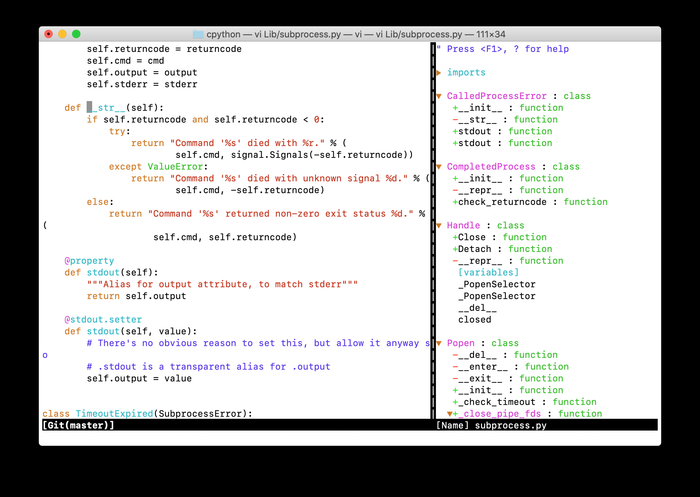

Conclusion 

 Within  vim  you can switch between tabs as   CTRL  +  W  , L to move to the right-hand pane, using the arrow keys to move up and down between the tagged functions. Press enter to skip to any function implementation. To move back to the editor pane press   CTRL  +  W  ,   H See Also Check out  vim adventures  for a fun way to learn and memorize the vim commands. 
#Conclusion 

 If you’re still undecided about which environment to use, you don’t need to make a decision right here and now. I used multiple environments while writing this book and working on changes to CPython. A critical feature for productivity is debugging, so having a reliable debugger that you can use to explore the runtime and understand bugs will save a lot of time. Especially if you’re used to relying on  print() 41