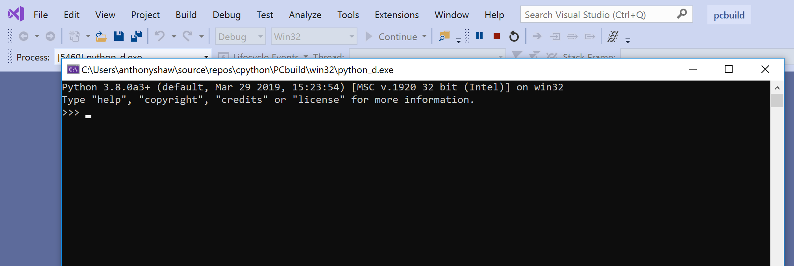

Compiling CPython on Windows To start the debug version of CPython, press   F5  and CPython will start in Debug mode straight into the REPL: 

 You can run the Release build by changing the build configuration from  Debug  to  Release  on the top menu bar and rerunning   Build Build Solution  . You now have both Debug and Release versions of the CPython binary within  PCBuild amd64 . You can set up Visual Studio to be able to open a REPL with either the Release or Debug build by choosing Tools Python Python Environments  from the top menu: In the Python Environments panel, click  Add Environment  and then target the Debug or Release binary. The Debug binary will end in _d.exe . For example,  python_d.exe  and  pythonw_d.exe . You will most likely want to use the debug binary as it comes with Debugging support in Visual Studio and will be useful for this book. In the Add Environment window, target the  python_d.exe  file as the interpreter inside  PCBuild amd64  and the  pythonw_d.exe  as the windowed interpreter: 56