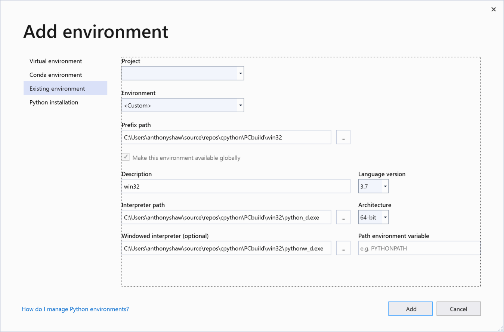
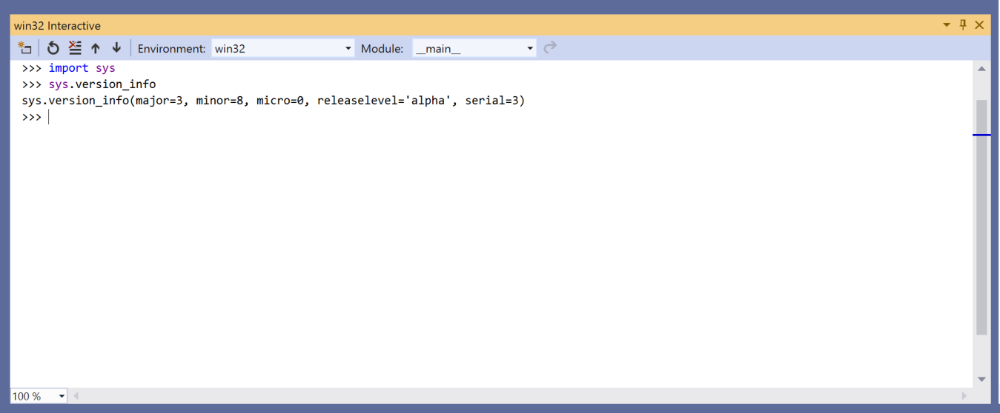

Compiling CPython on Windows 

 Start a REPL session by clicking   Open Interactive Window  in the Python Environments window and you will see the REPL for the compiled version of Python: 

 During this book, there will be REPL sessions with example commands. I encourage you to use the Debug binary to run these REPL sessions in case you want to put in any breakpoints within the code. 57