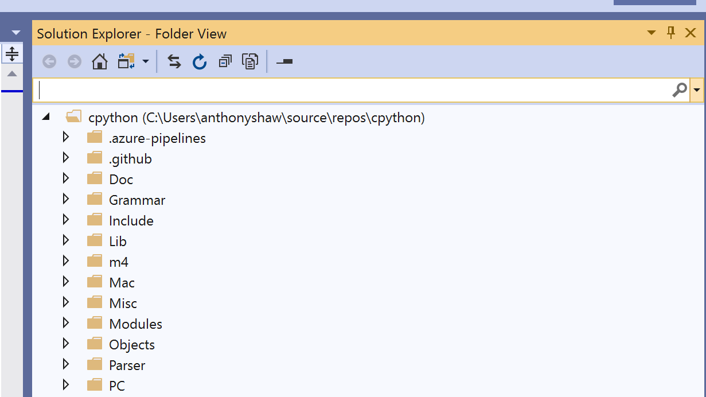

Profile Guided Optimization To make it easier to navigate the code, in the Solution View, click on the toggle button next to the Home icon to switch to Folder view: 

 
#Pro�le Guided Optimization 

 The macOS, Linux, and Windows build processes have flags for “PGO,” or “Profile Guided Optimization.” PGO is not something created by the Python team, but a feature of many compilers, including those used by CPython. PGO works by doing an initial compilation, then profiling the application by running a series of tests. The profile created is then analyzed, and the compiler will make changes to the binary that would improve performance. For CPython, the profiling stage runs  python -m test --pgo , which executes the regression tests specified in  Lib test libregrtest pgo.py . These tests have been specifically selected because they use a commonly used C extension module or type. 58