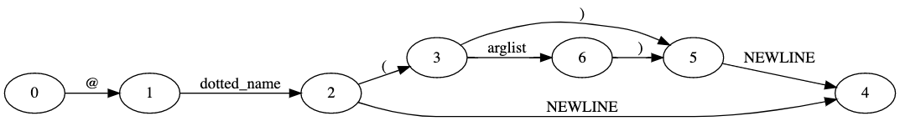

Regenerating Grammar in  Grammar/Grammar  as: decorator: '@' dotted_name [ '(' [arglist] ')' ] NEWLINE The parser generator creates a complex NFA graph of 11 states. Each of the states is numerically represented (with hints on their name in the grammar). The transitions are referred to as ‘arcs.’ The DFA is simpler than the NFA, with the paths reduced: 

 The NFA and DFA graphs are only useful for debugging the design of complex grammars. We will use Railroad Diagrams for representing grammar instead of DFA or NFA graphs. As an example, this diagram represents the paths that can be taken for the  decorator  statement: @ dotted_name ( arglist ) NEWLINE 
#Regenerating Grammar 

 To see  pgen  in action, let’s change part of the Python grammar. Search Grammar Grammar  for  pass_stmt  to see the definition of a  pass  statement: pass_stmt: 'pass' 70